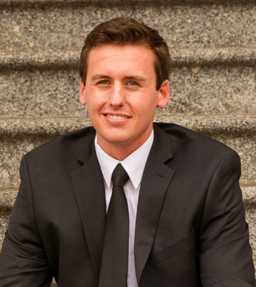

Tanner is a junior in the Computer Science program at the U. He spent the summer of 2015 as a Software Development intern with FamilySearch in Salt Lake City, where he developed tools for a team of data specialists to maintain a database of over 7 million points of data.

He has recently accepted an offer for a Software Engineer Internship with Microsoft, which will begin in May of 2016.

##Languages
C#, Java, Node.js, HTML, CSS, JavaScript
##Tools/Frameworks
VisualStudio, Eclipse, REST, Git/GitHub

##[Resume](../resources/resumes/tannerbarlow.resume.pdf) [Personal Website](http://tannerbarlow.com/) [GitHub](https://github.com/tbarlow12)
